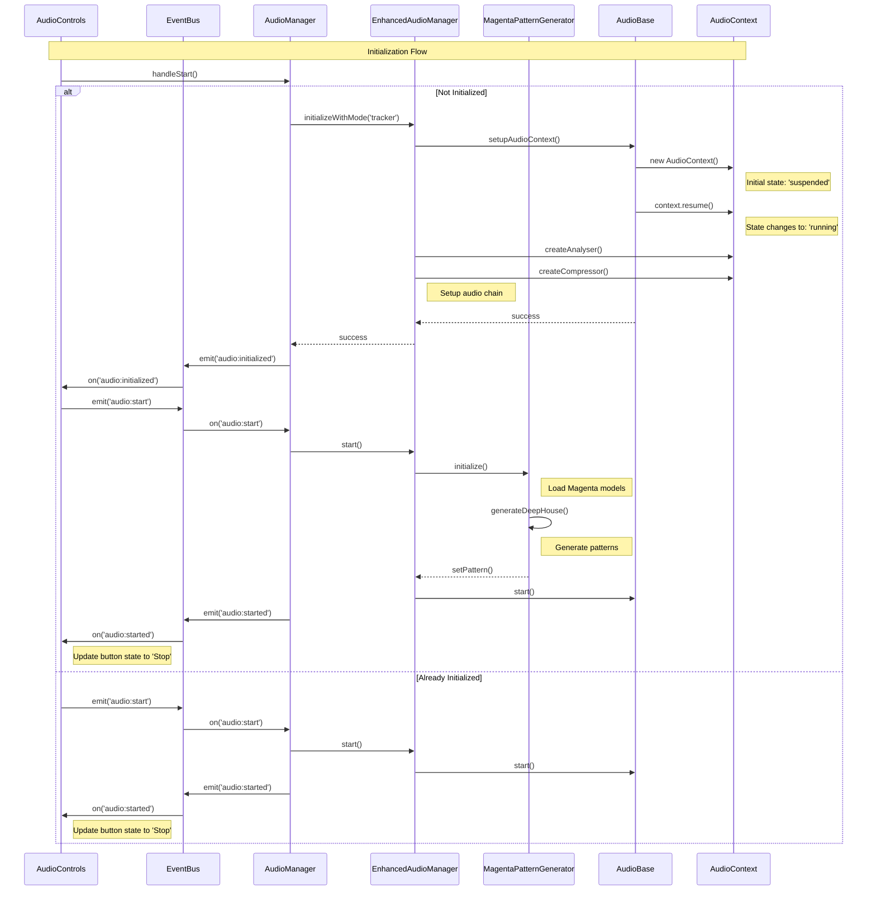
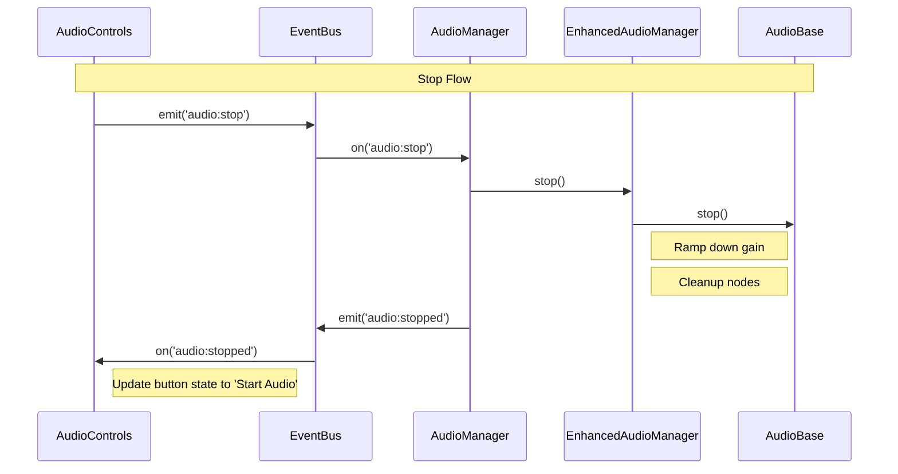
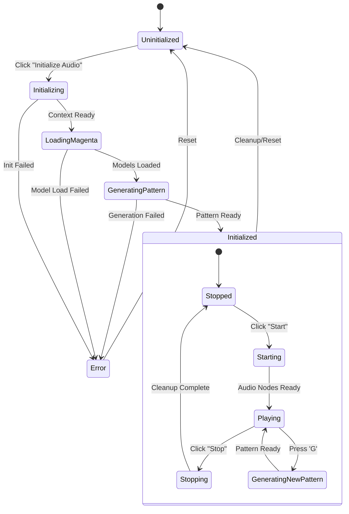
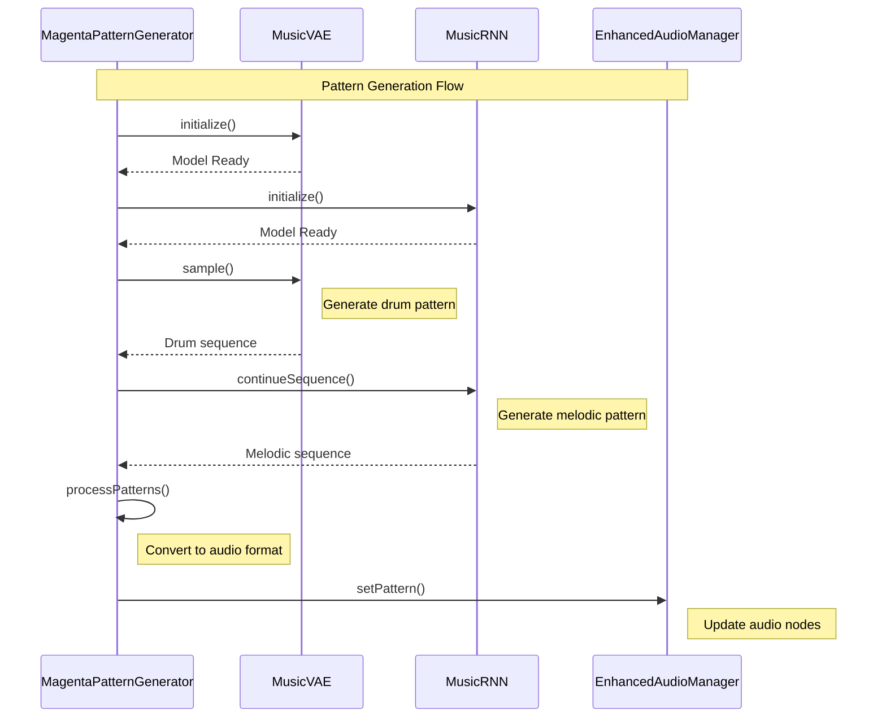

# Audio System Flow

This document details the audio system's initialization, playback, and state management flows.

## Initialization and Playback Flow

The following diagram shows the complete flow of audio initialization and playback:

## Stop Flow

This diagram illustrates the audio stop sequence:

## Audio System States

This diagram shows the possible states of the audio system:

## Pattern Generation Flow

This diagram shows the Magenta pattern generation process:

## Key Points

1. Enhanced Audio System:
   - Magenta model initialization
   - Pattern generation
   - Audio node setup (Analyser, Compressor)
   - Pattern processing and playback

2. Initialization Flow:
   - Context creation and setup
   - Magenta model loading
   - Pattern generation
   - State transitions
   - Event handling
   - Button state management

3. Playback Control:
   - Start/stop operations
   - Pattern generation
   - State synchronization
   - Event propagation
   - UI updates

4. State Management:
   - State transitions
   - Error handling
   - Resource cleanup
   - UI feedback

5. Event Flow:
   - Event emission
   - Event handling
   - State updates
   - Component synchronization

6. Pattern Generation:
   - Model initialization
   - Drum pattern generation
   - Melodic pattern generation
   - Pattern processing
   - Audio node updates
