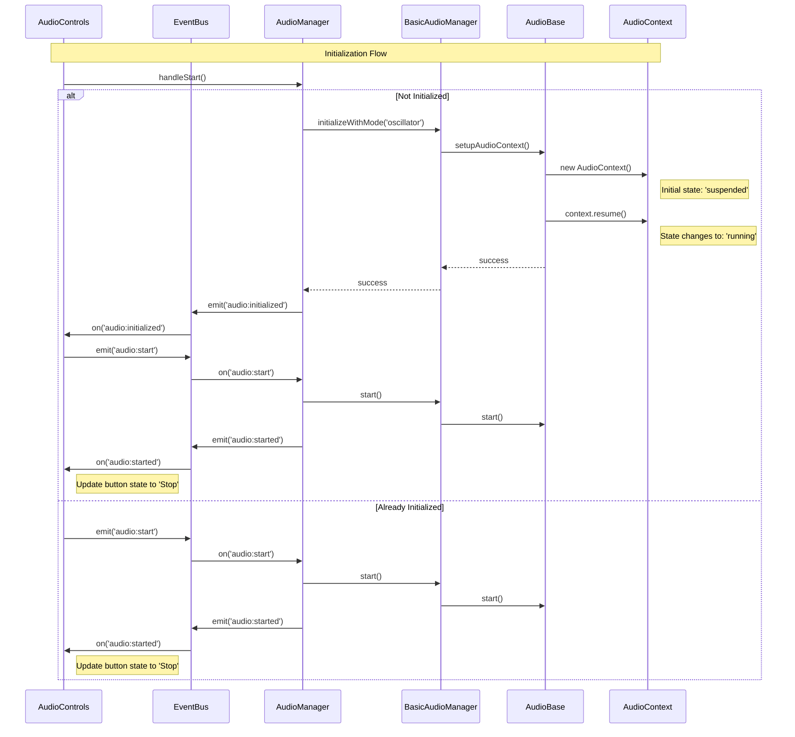
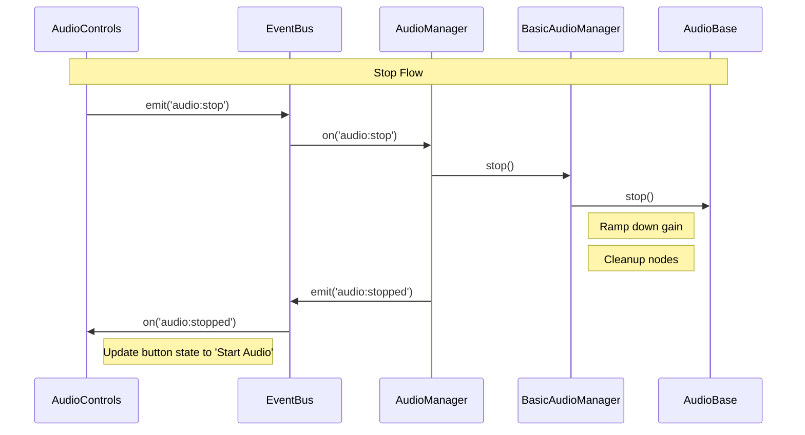
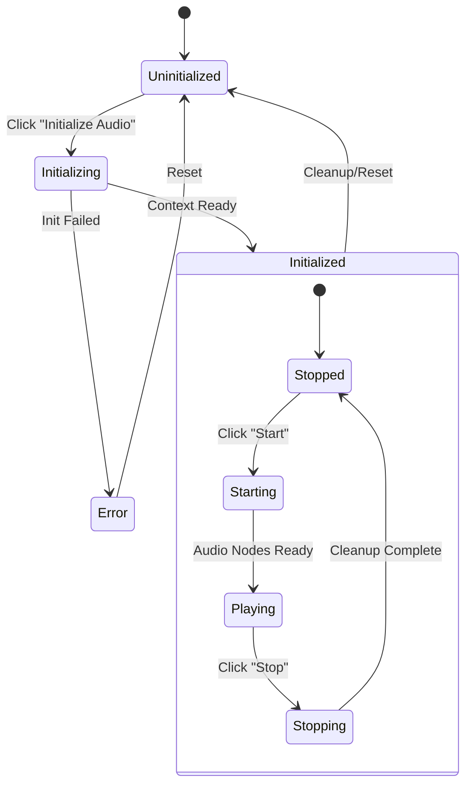

# Audio System Flow

This document details the audio system's initialization, playback, and state management flows.

## Initialization and Playback Flow

The following diagram shows the complete flow of audio initialization and playback:



## Stop Flow

This diagram illustrates the audio stop sequence:



## Audio System States

This diagram shows the possible states of the audio system:



## State Management Flow

This diagram details how state is managed between components:

```mermaid
sequenceDiagram
    participant UI as AudioControls
    participant AM as AudioManager
    participant BM as BasicAudioManager

    Note over UI,BM: State Management Flow
    
    state Initialized {
        UI->>+AM: handleStart()
        AM->>+BM: start()
        Note right of BM: Setup Audio Nodes
        BM-->>-AM: success
        AM->>EB: emit('audio:started')
        AM-->>-UI: Update State
        Note right of UI: Show Stop Button
    }

    state Playing {
        UI->>+AM: handleStop()
        AM->>+BM: stop()
        Note right of BM: Ramp Down Gain
        Note right of BM: Wait for Ramp (150ms)
        Note right of BM: Cleanup Nodes
        BM-->>-AM: success
        AM->>EB: emit('audio:stopped')
        AM-->>-UI: Update State
        Note right of UI: Show Start Button
    }
```

## Key Points

1. Initialization Flow:
   - Context creation and setup
   - State transitions
   - Event handling
   - Button state management

2. Playback Control:
   - Start/stop operations
   - State synchronization
   - Event propagation
   - UI updates

3. State Management:
   - State transitions
   - Error handling
   - Resource cleanup
   - UI feedback

4. Event Flow:
   - Event emission
   - Event handling
   - State updates
   - Component synchronization
