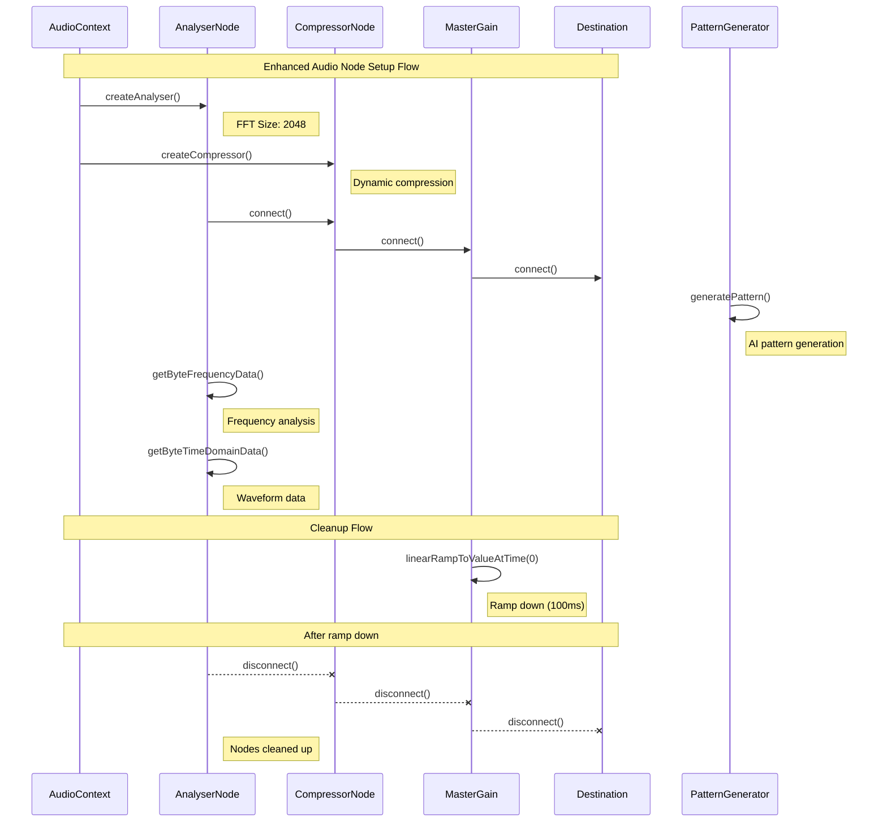
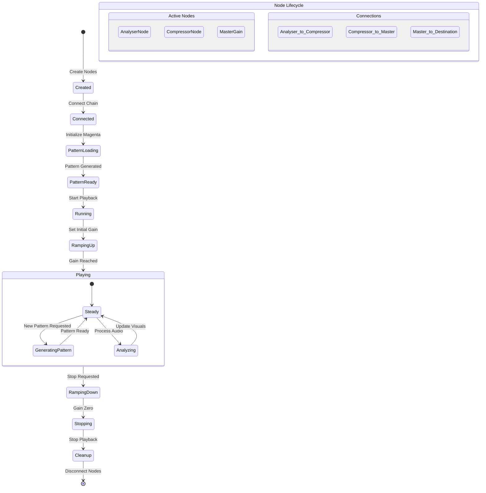
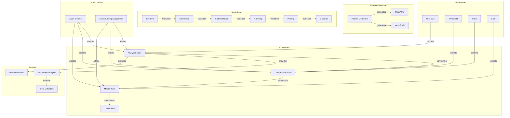

# Audio Node Lifecycle

This document details the lifecycle of audio nodes, including creation, connection, playback, and cleanup processes.

## Enhanced Audio Node Setup and Cleanup Flow

The following diagram shows the complete lifecycle of audio nodes in the enhanced audio system:

## Node State Transitions

This diagram illustrates the various states an audio node can be in:

## Enhanced Audio Node Architecture

This diagram shows the relationships between different audio nodes and their parameters:

## Key Concepts

1. Enhanced Node Setup:
   - AnalyserNode for real-time audio analysis
   - CompressorNode for dynamic range control
   - Pattern-based audio generation
   - Nodes connected in optimized chain
   - Real-time audio analysis

2. Node Lifecycle:
   - Created → Connected → Pattern Ready → Running → Playing
   - Pattern generation and updates during playback
   - Real-time audio analysis and visualization
   - Proper cleanup sequence on stop

3. Pattern Generation:
   - AI-powered pattern creation
   - Drum and melodic pattern synthesis
   - Pattern processing and playback
   - Real-time pattern updates

4. Analysis Features:
   - Frequency analysis
   - Waveform visualization
   - Beat detection
   - Audio metrics calculation

5. Cleanup Process:
   - Ramp down gain to avoid clicks
   - Wait for ramp completion
   - Stop pattern playback
   - Disconnect nodes in reverse order
   - Clear node references

6. State Management:
   - Track node states independently
   - Coordinate pattern generation
   - Handle parameter changes
   - Manage AudioContext state

## Important Considerations

1. Timing:
   - Pattern synchronization
   - Analysis timing
   - Smooth gain transitions
   - Cleanup timing
   - State synchronization

2. Resource Management:
   - Node creation/disposal
   - Pattern memory management
   - Connection optimization
   - Context state handling

3. Error Prevention:
   - Pattern generation fallbacks
   - State validation
   - Connection verification
   - Parameter bounds checking
   - Cleanup confirmation

4. Performance:
   - Efficient node creation
   - Optimized pattern processing
   - Analysis buffer management
   - Resource pooling
   - Memory optimization
