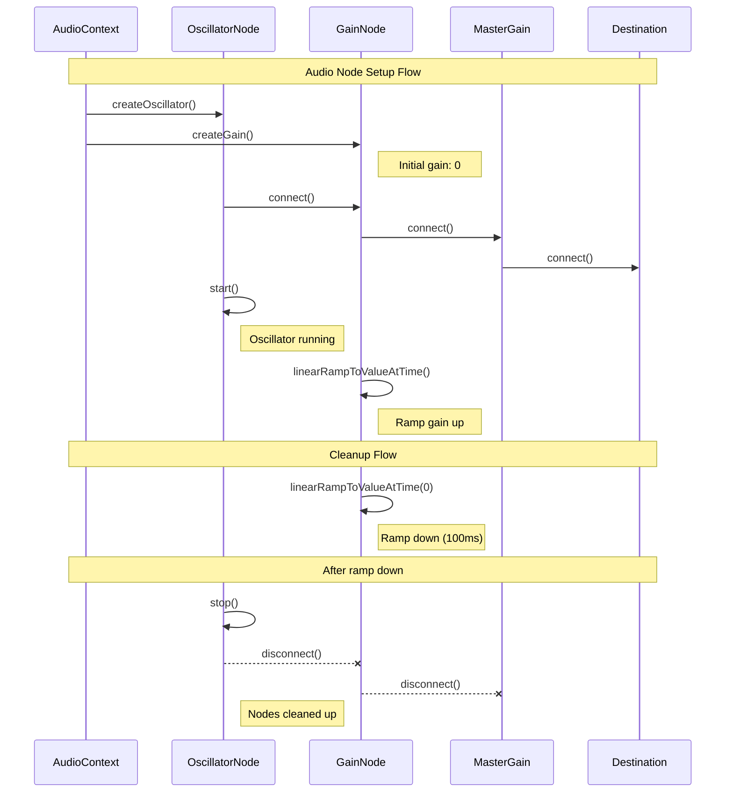
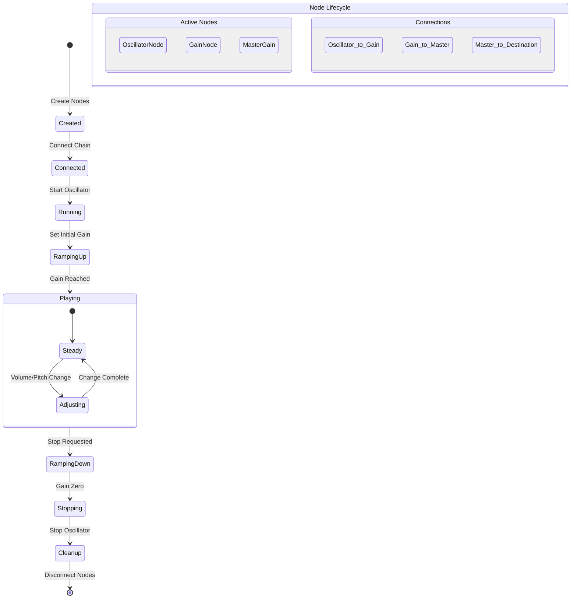
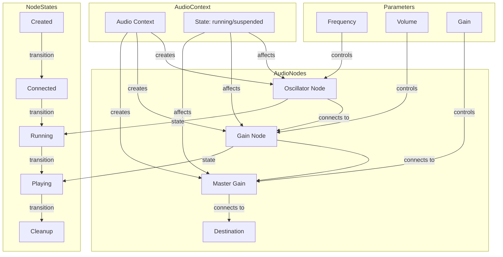

# Audio Node Lifecycle

This document details the lifecycle of audio nodes, including creation, connection, playback, and cleanup processes.

## Audio Node Setup and Cleanup Flow

The following diagram shows the complete lifecycle of audio nodes:

## Node State Transitions

This diagram illustrates the various states an audio node can be in:

## Audio Node Architecture

This diagram shows the relationships between different audio nodes and their parameters:

## Key Concepts

1. Node Setup:
   - OscillatorNode created with frequency
   - GainNode created with initial gain of 0
   - Nodes connected in chain
   - Oscillator started immediately
   - Gain ramped up smoothly

2. Node Lifecycle:
   - Created → Connected → Running → Playing
   - Volume/Pitch adjustments during playback
   - Proper cleanup sequence on stop

3. Cleanup Process:
   - Ramp down gain to avoid clicks
   - Wait for ramp completion
   - Stop oscillator
   - Disconnect nodes in reverse order
   - Clear node references

4. State Management:
   - Track node states independently
   - Coordinate state changes
   - Handle parameter changes
   - Manage AudioContext state

## Important Considerations

1. Timing:
   - Proper sequencing of node creation
   - Smooth gain transitions
   - Cleanup timing
   - State synchronization

2. Resource Management:
   - Node creation/disposal
   - Connection management
   - Memory usage
   - Context state

3. Error Prevention:
   - State validation
   - Connection verification
   - Parameter bounds checking
   - Cleanup confirmation

4. Performance:
   - Efficient node creation
   - Optimized connections
   - Proper cleanup
   - Resource pooling
