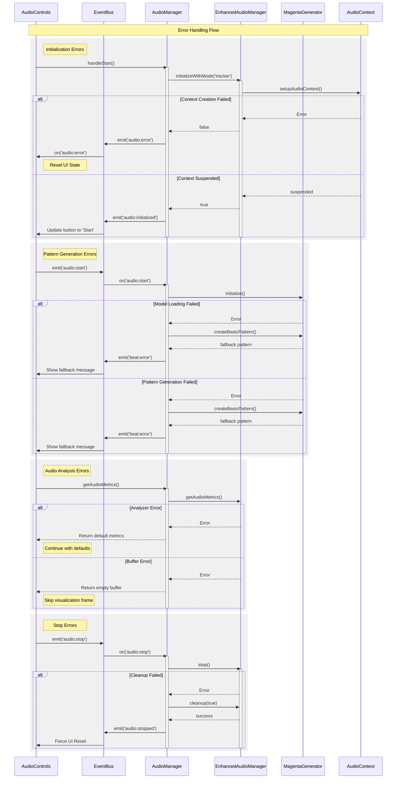
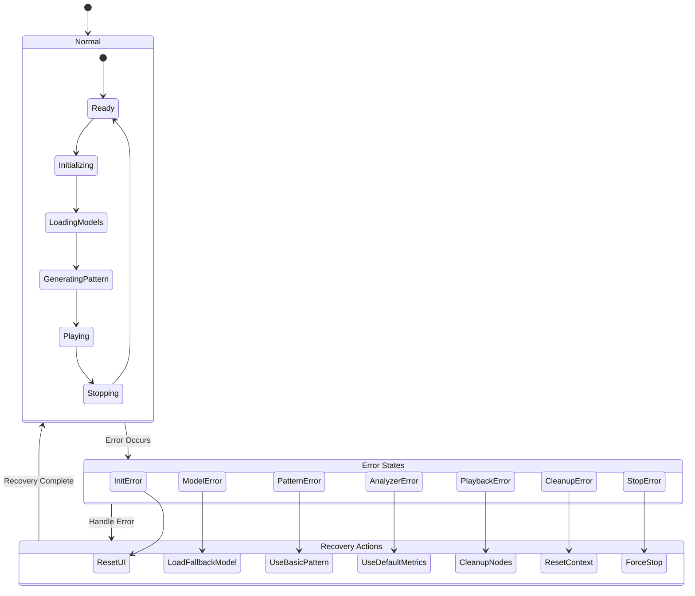
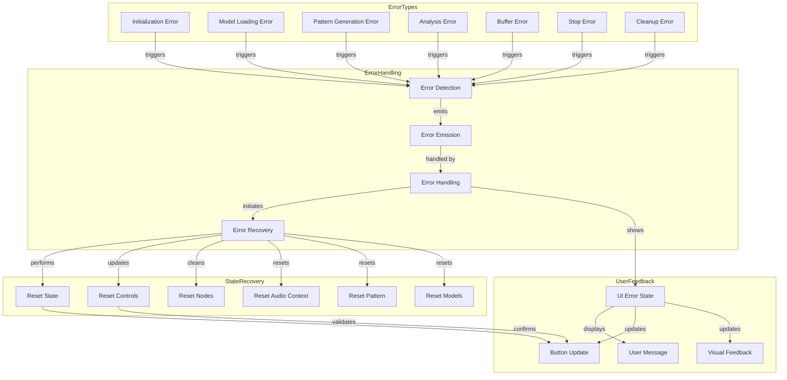

# Error Handling Flow

This document details the error handling strategies and recovery procedures in the Audio Visualizer system.

## Error Handling Sequence

The following diagram shows how different types of errors are handled:

## Error States and Recovery

This diagram shows the different error states and recovery paths:

## Error Handling Architecture

This diagram shows how errors are processed through the system:

## Error Categories

1. Initialization Errors
   - Context creation failures
   - Setup failures
   - Resource allocation failures
   - Permission denied errors

2. Model Errors
   - Model loading failures
   - Initialization failures
   - Network errors
   - Memory limitations

3. Pattern Generation Errors
   - Invalid pitch range
   - Generation timeout
   - Model output errors
   - Processing failures

4. Analysis Errors
   - Analyzer node failures
   - Buffer errors
   - Processing errors
   - Data conversion errors

5. Playback Errors
   - Node creation failures
   - Connection failures
   - State transition errors
   - Resource exhaustion

6. Stop Errors
   - Cleanup failures
   - State reset failures
   - Resource release errors
   - Context closure errors

7. Resource Errors
   - Memory allocation failures
   - Connection limits reached
   - Buffer overflows
   - Context state errors

## Error Handling Strategy

1. Detection
   - Monitor operations
   - Validate state changes
   - Check resource availability
   - Verify connections
   - Validate patterns
   - Check model states

2. Response
   - Emit appropriate error event
   - Log error details
   - Update UI state
   - Initiate recovery
   - Use fallback patterns
   - Switch to basic mode

3. Recovery
   - Reset system state
   - Clean up resources
   - Restore UI controls
   - Re-initialize if needed
   - Load fallback models
   - Use basic patterns

4. Prevention
   - State validation
   - Resource checks
   - Connection verification
   - Pattern validation
   - Model pre-loading
   - Error boundaries

## Best Practices

1. Error Handling
   - Always clean up resources
   - Provide user feedback
   - Log error details
   - Maintain state consistency
   - Use fallback patterns
   - Handle model errors gracefully

2. Recovery
   - Graceful degradation
   - State restoration
   - Resource cleanup
   - User notification
   - Pattern fallbacks
   - Model reinitialization

3. Prevention
   - Input validation
   - State checks
   - Resource monitoring
   - Connection verification
   - Pattern validation
   - Model state tracking
