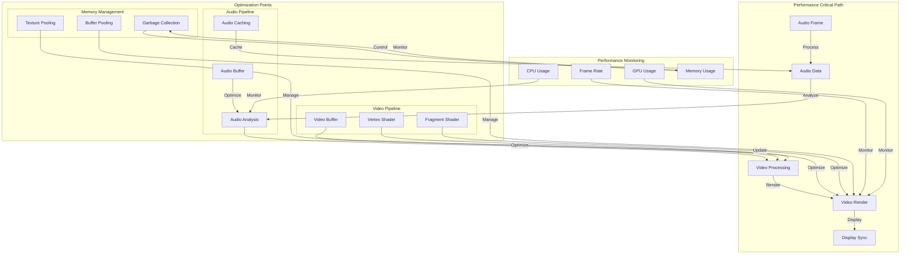
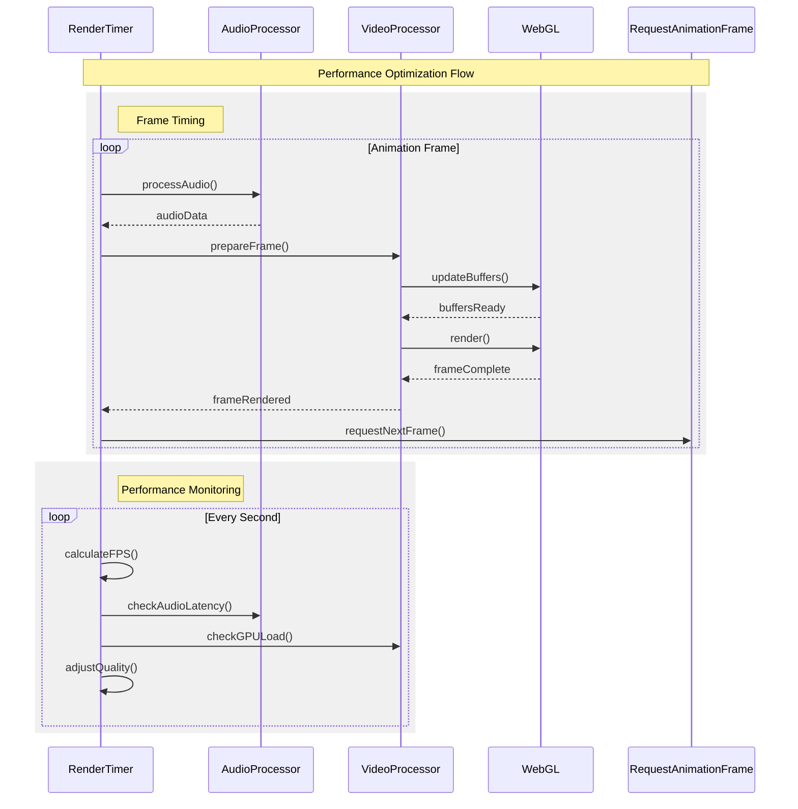
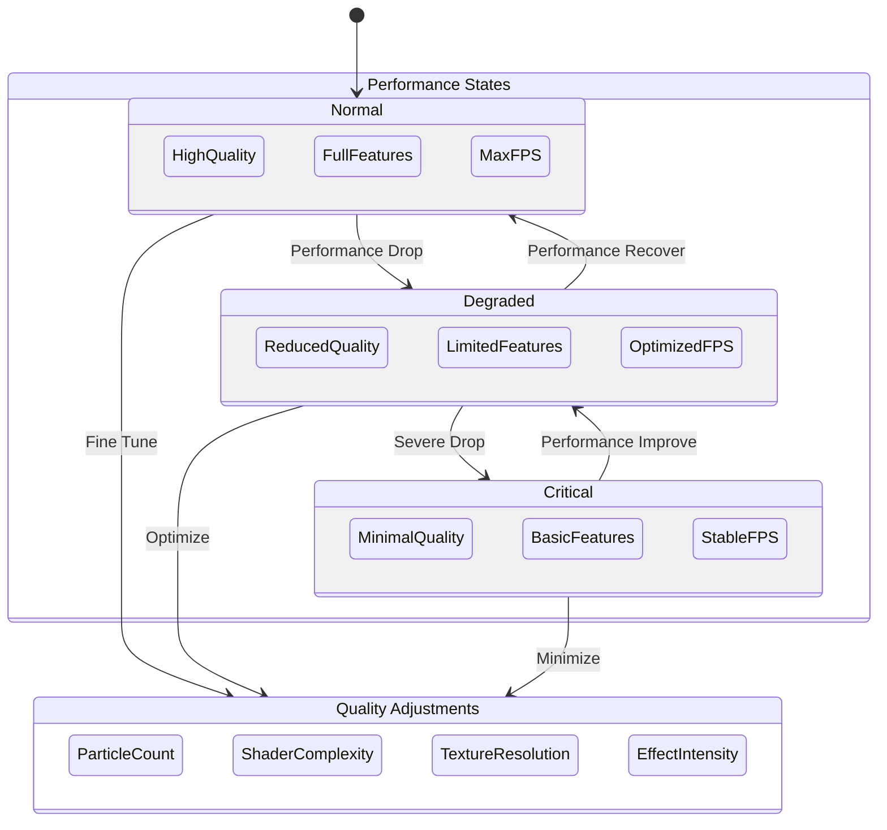
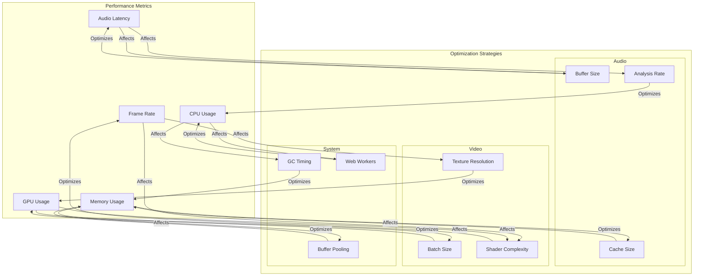

# Performance Optimization Flow

This document details the performance monitoring, optimization strategies, and resource management in the Audio Visualizer system.

## Performance Critical Path

The following diagram shows the critical path for performance optimization:

## Performance Optimization Flow

This diagram shows how performance is monitored and optimized:

## Performance States

This diagram illustrates different performance states and quality adjustments:

## Performance Metrics and Optimization

This diagram shows how different metrics affect optimization strategies:

## Key Performance Areas

1. Frame Timing
   - Maintain consistent frame rate
   - Minimize audio-visual latency
   - Optimize render loop
   - Balance quality vs performance

2. Resource Management
   - Efficient buffer usage
   - Texture pooling
   - Memory management
   - Garbage collection timing

3. Quality Adjustments
   - Dynamic quality scaling
   - Feature toggling
   - Resolution adjustment
   - Effect intensity control

4. Monitoring
   - Frame rate tracking
   - Audio latency
   - CPU/GPU usage
   - Memory consumption

## Optimization Strategies

1. Audio Pipeline
   - Optimize buffer sizes
   - Cache frequency data
   - Batch audio processing
   - Use Web Workers

2. Video Pipeline
   - Batch rendering
   - Shader optimization
   - Texture management
   - GPU memory usage

3. System Resources
   - Memory pooling
   - GC optimization
   - Worker distribution
   - Resource cleanup

## Best Practices

1. Performance Monitoring
   - Regular metrics collection
   - Threshold monitoring
   - Performance logging
   - User experience tracking

2. Resource Management
   - Proactive optimization
   - Resource pooling
   - Memory defragmentation
   - Cache management

3. Quality Control
   - Adaptive quality settings
   - Progressive enhancement
   - Feature prioritization
   - Performance budgets

4. Optimization Timing
   - Strategic GC timing
   - Frame timing control
   - Resource preloading
   - Async operations
