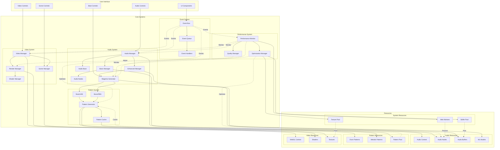
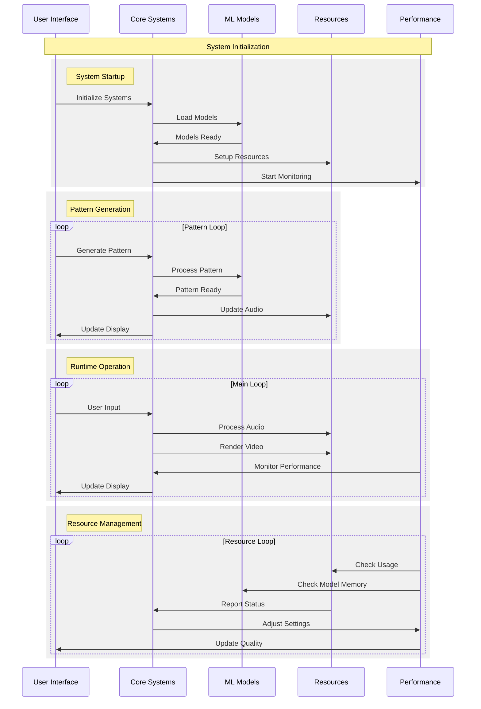
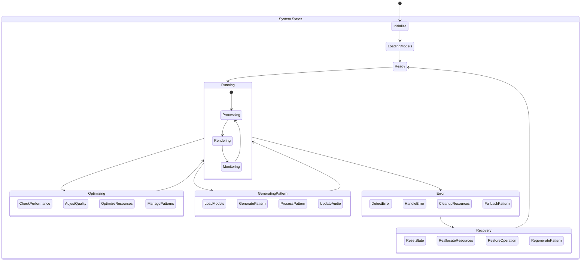

# System Architecture

This document provides a comprehensive overview of the Audio Visualizer system architecture, showing how different components interact and how data flows through the system.

## Component Architecture

The following diagram shows the main components of the system and their relationships:

## System Initialization Flow

This diagram shows the initialization sequence of the system:

## System States

This diagram illustrates the various states the system can be in:

## Key Components

1. User Interface Layer
   - Audio Controls
   - Video Controls
   - Scene Controls
   - Pattern Controls
   - Event Handling

2. Core Systems
   - Audio Processing
   - Pattern Generation
   - Video Rendering
   - Performance Management
   - Event Management

3. Pattern Generation
   - MusicVAE Model
   - MusicRNN Model
   - Pattern Processing
   - Pattern Caching

4. Resource Management
   - Audio Resources
   - Pattern Resources
   - Video Resources
   - System Resources
   - Resource Pooling

5. Performance Optimization
   - Real-time Monitoring
   - Quality Management
   - Resource Optimization
   - Worker Distribution
   - Pattern Optimization

## Integration Points

1. Audio-Pattern Integration
   - Model initialization
   - Pattern generation
   - Audio processing
   - Pattern synchronization

2. Audio-Video Sync
   - Audio frame processing
   - Video frame rendering
   - Timing synchronization
   - Buffer management

3. Performance-Quality Balance
   - Resource monitoring
   - Quality adjustment
   - Performance optimization
   - Feature scaling
   - Pattern complexity

4. Error Recovery
   - System state management
   - Resource reallocation
   - Operation restoration
   - Pattern fallback
   - User feedback

5. Resource Coordination
   - Buffer pooling
   - Worker management
   - Memory optimization
   - Context handling
   - Model management
