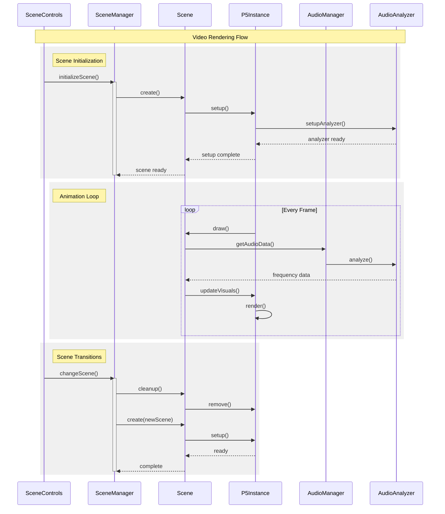
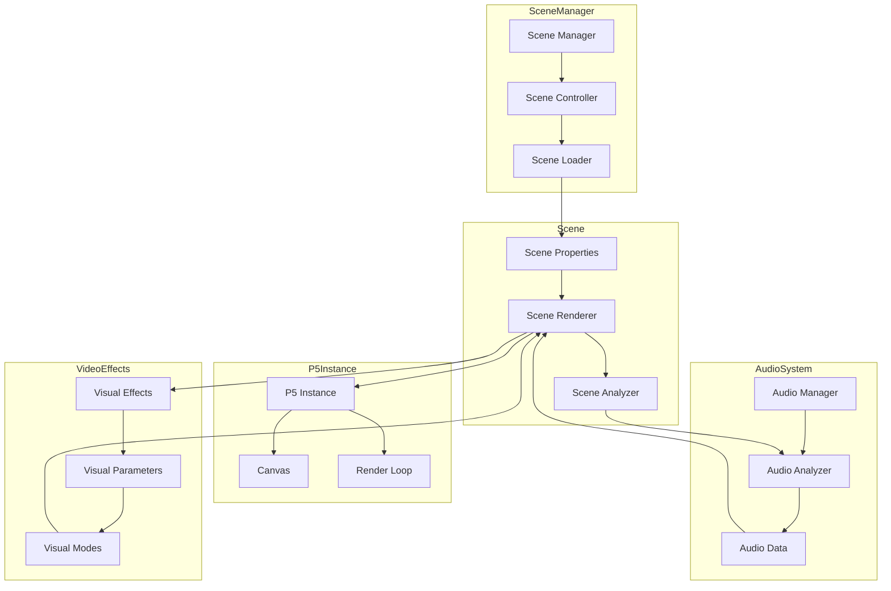
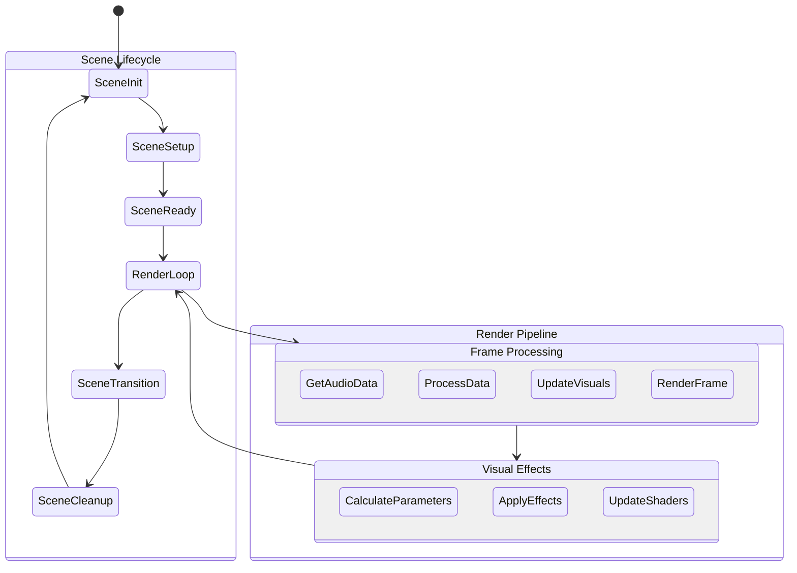
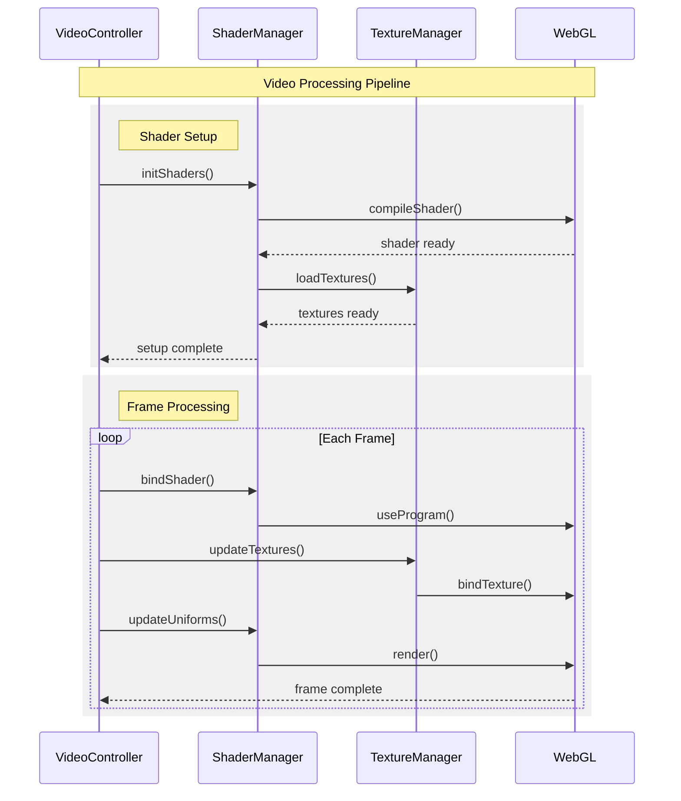

# Video System Flow

This document details the video visualization system, including scene management, rendering pipeline, and audio-visual synchronization.

## Scene Management Flow

The following diagram shows how scenes are initialized and managed:

## Component Architecture

This diagram shows the relationships between different components of the video system:

## Scene Lifecycle

This diagram illustrates the lifecycle of a scene:

## Shader Processing Pipeline

This diagram shows how shaders are managed and applied:

## Key Components

1. Scene Management
   - Scene initialization
   - Scene transitions
   - Resource management
   - State handling

2. Rendering Pipeline
   - Frame processing
   - Audio data integration
   - Visual effect application
   - Performance optimization

3. Audio-Visual Integration
   - Audio data analysis
   - Visual parameter mapping
   - Effect synchronization
   - Real-time updates

4. Resource Management
   - Texture handling
   - Shader compilation
   - Buffer management
   - Memory optimization

## Performance Considerations

1. Frame Timing
   - Consistent frame rate
   - Audio-visual sync
   - Effect timing
   - State updates

2. Resource Usage
   - Memory management
   - GPU utilization
   - Buffer optimization
   - Asset loading

3. Visual Quality
   - Effect complexity
   - Resolution scaling
   - Shader optimization
   - Quality settings

4. Optimization
   - Frame skipping
   - Quality adjustment
   - Resource pooling
   - State caching
